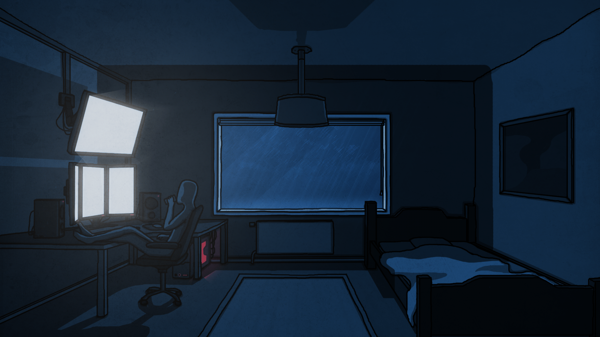

<!-- Full-width Aesthetic Background -->

  <!-- Name in Techy Pixelated Font -->
  <h1 align="center" style="font-size: 80px; color: #1db954; background-color: rgba(0, 0, 0, 0.8); padding: 10px;">Sri Ujwal Reddy</h1>

  <!-- Subheading in a Pixelated Style -->
  <h3 align="center" style="font-size: 40px; color: #00ffff; background-color: rgba(33, 33, 33, 0.8); padding: 5px; display: inline-block;">
    Software Developer
  </h3>

  <!-- Full-width Aesthetic GIF -->
  

    
  

 
 

---

<!-- GitHub Stats and Contribution Graph with Consistent Theme -->

  

  

<!-- Activity Graph -->

  

## Random Dev Quote

---

